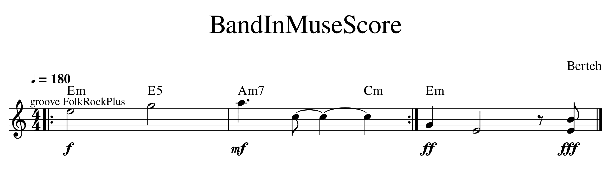

# BandInMuseScore
MIDI accompaniment for MuseScore, automatically generated by [MMA Musical Midi Accompaniment](https://www.mellowood.ca/mma/index.html).

## Example
Hear for yourself how the plain few measures of the sample BandInMuseScore track below sound [better with the default Folk accompaniment (tiny mp3)](https://gitcdn.xyz/repo/berteh/BandInMuseScore/master/example/BandInMuseScore_with_mma.mp3), in our [example](https://github.com/berteh/BandInMuseScore/tree/master/example) directory: [MSCz](https://gitcdn.xyz/repo/berteh/BandInMuseScore/master/example/BandInMuseScore.mscz) > [MMA](https://github.com/berteh/BandInMuseScore/blob/master/example/BandInMuseScore.mma) > [MIDI](https://gitcdn.xyz/repo/berteh/BandInMuseScore/master/example/BandInMuseScore.mid) > [MP3](https://gitcdn.xyz/repo/berteh/BandInMuseScore/master/example/BandInMuseScore_with_mma.mp3)

This plugin has been tested on Linux (Ubuntu) with MuseScore 2.3.2, and on Windows8 with MuseScore 3.2.3. It should work fine on Mac as well. It's work in progress, usable and perfectible, suggestions and help are welcome (see [Roadmap](#roadmap--contribute)).

## HowTo
- Install [MMA MIDI Accompaniment](https://www.mellowood.ca/mma/index.html) for your OS (it's Free). Additional info (esp. for Windows) see [INSTALL.md](INSTALL.md)
- [Download BandInMuseScore](https://github.com/berteh/BandInMuseScore/archive/master.zip) plugin
- Open your score with chords symbols in MuseScore
- Launch plugin creator, open BandInMuseScore plugin from there, click `run`, it will create MMA file automatically.

Then (for now) generate the mid (MIDI) file of the accompaniment from the command line, and open it in MuseScore (or your usual MIDI player, like ``timidity``)

    mma ./MMAtemp.mma
    timidity ./MMAtemp.mid
    musescore ./MMAtemp.mid
    
## Features
MuseScore __Chords__, __Tempo__, __Time Signatures__ and (simple) __Repeat Bars__ elements are natively supported.

Any __Staff Text__ element (shortcut ``CTRL+T``) in your score will be considered as a MMA directive and provided as such to the accompaniment generator. You can therewith change the groove, the instruments, *add metronome clicks* and do much more, such as in the Roman Rock in our  [example](https://github.com/berteh/BandInMuseScore/tree/master/example) directory: [MSCz](https://gitcdn.xyz/repo/berteh/BandInMuseScore/master/example/Roman_Rock.mscz) > [MMA](https://github.com/berteh/BandInMuseScore/blob/master/example/Roman_Rock.mma) > [MIDI](https://gitcdn.xyz/repo/berteh/BandInMuseScore/master/example/Roman_Rock.mid) > [MP3](https://gitcdn.xyz/repo/berteh/BandInMuseScore/master/example/Roman_Rock_MMA.mp3) + [PDF](https://gitcdn.xyz/repo/berteh/BandInMuseScore/master/example/Roman_Rock_MMA.pdf)

To prevent cluttering your Scores too much, simply make the MMA Statt Text elements not visible, so they don't export to PDF.

Some others elements would be great to have but are not there yet, don't hesitate to contribute some code to improve the plugin:

- KeySignatures
- Dynamics

## Customizing Accompaniment
[MMA Musical Midi Accompaniment](https://www.mellowood.ca/mma/index.html) has multiple available styles, grooves, patterns and many more features. Including the ability to generate melodies, tailor instruments and much more. Read it's [reference manual](https://www.mellowood.ca/mma/online-docs/html/ref/mma.html) and customize your accompaniment to your liking.

[Many styles](MMA-Styles.md) are provided to play with, from foxtrot to rock via waltz, calypso, blues, jazz or trance. It's possible to import your favorite BandInABox songs or Yahama STYles files into MMA, read it's [documentation](https://www.mellowood.ca/mma/helpers.html#convert).

## Roadmap / Contribute
Please help us for the following (mostly in priority order)... some of which I may do if I find some time:
- make MMA generation from within musescore work, so you don't need the command line step (for now it looks like the groove library is not being found by mma when called from within MuseScore with default settings)
- find a way to import the generated mid file from the plugin API, and (even better) merge it in a copy of the original leadsheet.
- improve the quality / features of the generated MMA accompaniment.
- change important console.log() feedback to proper user dialogs, so the plugin can be used outside of PluginCreator.
- add interesting MMA styles and grooves to MMA, and thus BandInMuseScore.
