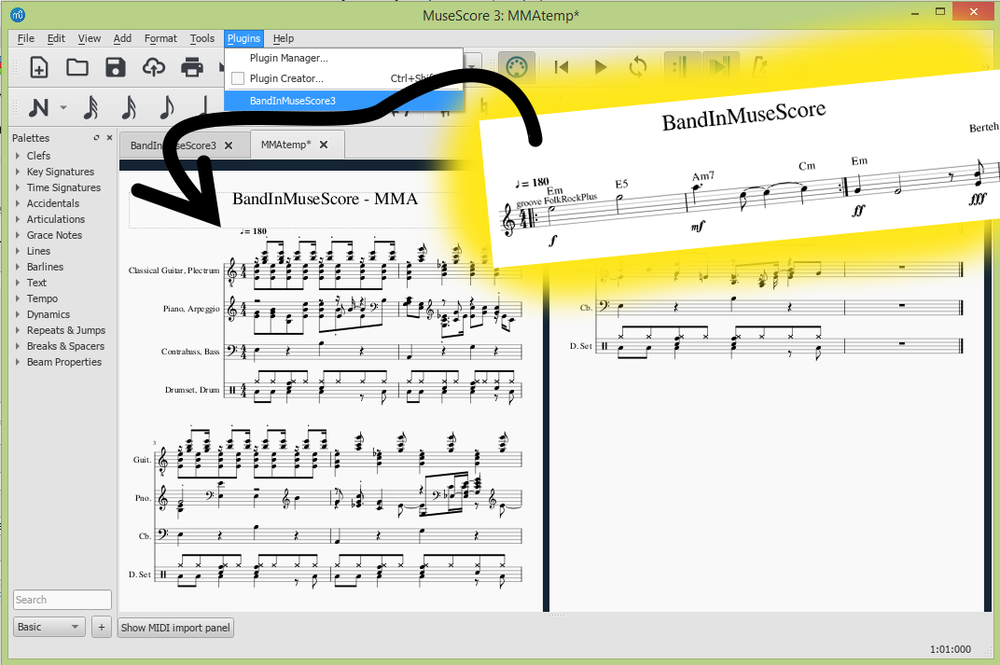

# BandInMuseScore
Accompaniment generator for MuseScore3, an OpenSource alternative to Band-In-A-Box and others, auto-magically generated by [MMA Musical Midi Accompaniment](https://www.mellowood.ca/mma/index.html).

## Example
Hear for yourself how the plain few measures of the sample BandInMuseScore track below sound [better with the default Folk accompaniment (tiny mp3)](https://gitcdn.xyz/repo/berteh/BandInMuseScore/master/example/BandInMuseScore_with_mma.mp3), in our [example](https://github.com/berteh/BandInMuseScore/tree/master/example) directory: [MSCz](https://gitcdn.xyz/repo/berteh/BandInMuseScore/master/example/BandInMuseScore.mscz) > [MMA](https://github.com/berteh/BandInMuseScore/blob/master/example/BandInMuseScore.mma) > [MIDI](https://gitcdn.xyz/repo/berteh/BandInMuseScore/master/example/BandInMuseScore.mid) > [MP3](https://gitcdn.xyz/repo/berteh/BandInMuseScore/master/example/BandInMuseScore_with_mma.mp3)

This plugin has been tested on Linux (Ubuntu) and Windows8 with MuseScore 3.2.3. It should work fine on MacOSX as well. 
It is work in progress, usable and perfectible, suggestions and help are welcome (see [Roadmap](#roadmap--contribute)).

## HowTo
- Install [MMA MIDI Accompaniment](https://www.mellowood.ca/mma/index.html) for your OS (it's Free). Additional info see [INSTALL.md](INSTALL.md), esp. for Windows.
- [Download BandInMuseScore](https://github.com/berteh/BandInMuseScore/archive/master.zip) plugin and uncompress it in your MuseScore plugins direcory.
- Open your score with chords symbols in MuseScore
- Enable plugin BandInMuseScore3 from the Plugin Manager, then run it from the plugins menu. The generated accompaniment will open in MuseScore.
    
## Features
MuseScore __Chords__, __Tempo__, __Time Signatures__ and (simple) __Repeat Bars__ elements are natively supported.

Any __Staff Text__ element (shortcut ``CTRL+T``) in your score will be considered as a MMA directive and provided as such to the accompaniment generator. You can therewith [change the groove/style](MMA-Styles.md), the instruments, *add metronome clicks* and [do much more](https://www.mellowood.ca/mma/online-docs/html/ref/mma.html), such as in the Roman Rock in our  [example](https://github.com/berteh/BandInMuseScore/tree/master/example) directory: [MSCz](https://gitcdn.xyz/repo/berteh/BandInMuseScore/master/example/Roman_Rock.mscz) > [MMA](https://github.com/berteh/BandInMuseScore/blob/master/example/Roman_Rock.mma) > [MIDI](https://gitcdn.xyz/repo/berteh/BandInMuseScore/master/example/Roman_Rock.mid) > [MP3](https://gitcdn.xyz/repo/berteh/BandInMuseScore/master/example/Roman_Rock_MMA.mp3) + [PDF](https://gitcdn.xyz/repo/berteh/BandInMuseScore/master/example/Roman_Rock_MMA.pdf)

To prevent cluttering your Scores too much, simply make the MMA Staff Text elements not visible, so they don't export to PDF.

Some others elements would be great to have but are not there yet, don't hesitate to contribute some code to improve the plugin:

- KeySignatures
- Dynamics

## Customizing Accompaniment
[MMA Musical Midi Accompaniment](https://www.mellowood.ca/mma/index.html) has multiple available styles, grooves, patterns and many more features. Including the ability to generate melodies, tailor instruments and much more. Read it's [reference manual](https://www.mellowood.ca/mma/online-docs/html/ref/mma.html) and customize your accompaniment to your liking.

[Many styles](MMA-Styles.md) are provided to play with, from foxtrot to rock via waltz, calypso, blues, jazz or trance. It's possible to import your favorite BandInABox songs or Yahama STYles files into MMA, read it's [documentation](https://www.mellowood.ca/mma/helpers.html#convert).

## Roadmap / Contribute
Please help us for the following (mostly in priority order)... some of which I may do if I find some time:
- find a way to merge lead and accompaniment in a new score.
- improve the quality / features of the generated MMA accompaniment.
- add interesting MMA styles and grooves to MMA, and thus BandInMuseScore.
